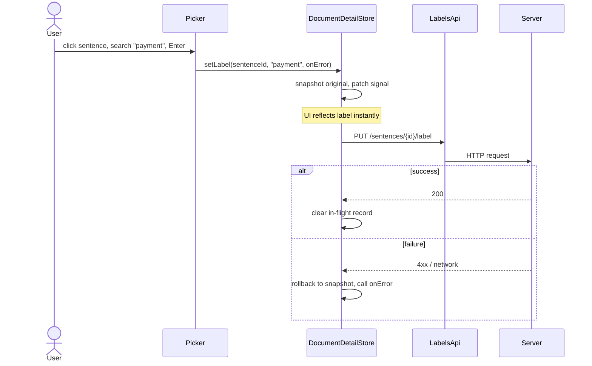

# Contract Clause Tracker


A small web app for labelling legal clauses sentence-by-sentence across a contract library. A play project to spend time on streaming uploads, optimistic UI, and accessible inline labelling on long-form legal text.

## Running it

```bash
docker compose up --build
```

Then open http://localhost:4200. The API serves at http://localhost:8000/api, with OpenAPI docs at `/api/docs`.

## What's in scope

Three things: upload a contract (txt or markdown), label individual sentences with clause types in a viewer, and a dashboard with search, filter, grouping, and sort. Everything else I considered is in [Future work](#future-work) at the bottom.

## How it's put together

**Backend — FastAPI, SQLite, SQLAlchemy 2.0.** Upload `POST`s the file, the API validates it, creates the `Document` row, kicks off parsing as an `asyncio` task, and returns `201` immediately — the client never waits on the parse. The parser splits the text into sentences (each one a row with a `clause_type_id` column for the label) using a regex-plus-abbreviation-merger splitter that handles the legal abbreviations (`Inc.`, `Art.`, `e.g.`) without falling over on contracts with tens of thousands of sentences. Sentences track a `paragraph_idx` derived from source-line boundaries, so the viewer can re-group them into paragraphs without guessing. A separate `GET /api/documents/{id}/progress` Server-Sent Events stream emits sentences in batches as they're persisted, plus a one-shot snapshot of whatever's already in the DB when a client subscribes — so refreshing a tab mid-parse picks up where it left off. The schema also ships a `clause_suggestions` table and a `GET /api/documents/{id}/suggestions` endpoint that returns `[]` today; those are the seam for the auto-labelling step I want to add next.

**Frontend — Angular 17, signals, CDK Overlay, CDK virtual scroll.** Standalone components throughout. The dashboard's search / filter / grouping / sort state is bound to the URL query string, so any view is bookmarkable and shareable. The viewer wraps the sentence list in `cdk-virtual-scroll-viewport` with the autosize strategy from `@angular/cdk-experimental`, so even a 100k-sentence document only mounts the visible window (~40 rows). Sentences with the same `paragraph_idx` render inline inside a `<p>`, so prose flows continuously across line wraps instead of stacking as a list — each sentence cell is a `<span role="button" tabindex="0">` (not a `<button>`, because browsers coerce `display: inline` on form controls to `inline-block`, which would break the flow). The labelling popover is a CDK ConnectedOverlay anchored to the clicked sentence, implementing the ARIA combobox pattern: typeable search, arrow navigation, Enter applies, Backspace removes when the query is empty, Escape closes. Label changes are optimistic against the local signal and roll back on API failure.

### The labelling round-trip

The critical interaction in the app — and the part most worth understanding — is the optimistic-with-rollback path. It's the same sequence whether the user accepts an AI suggestion (future work) or applies a manual label:



The non-obvious detail is the *snapshot*. On rapid re-clicks of the same sentence, the second call doesn't capture the optimistic intermediate value — it preserves the *original* pre-action label, so any rollback unwinds to the true starting state rather than a half-applied one. Covered by [`document-detail.store.spec.ts`](frontend/src/app/core/stores/document-detail.store.spec.ts) (the `setLabel — rapid concurrent calls` block).

### Architecture choices

- **SQLite over Postgres.** No concurrency, ops, or vendor extensions needed at this scale. One fewer service in the compose file, one less thing to defend.
- **Streaming upload, not request-coupled progress.** Parsing detaches from the `POST` so the viewer opens immediately and survives refresh — work runs to completion regardless of which client is connected. SSE over a separate GET channel, not NDJSON over the upload, not WebSockets (server push only — bidirectional is the wrong shape), not polling. The progress endpoint serves a snapshot of persisted sentences on subscribe and then forwards live events, so late subscribers and reconnects catch up without a gap.
- **Paragraph boundaries live in the schema, not in the renderer.** `paragraph_idx` is set by the splitter at ingest time from the source-line structure of the file. The frontend groups by that key — no heuristic chunking in the viewer. The schema cost is one `INTEGER NOT NULL DEFAULT 0` column with a `paragraph_idx = idx` backfill so legacy docs render unchanged.
- **Virtualise the viewer, fixed-size strategies need not apply.** Sentence rows are variable height (headings, wrapped paragraphs, labelled vs unlabelled chip). `cdk-virtual-scroll-viewport` with the `AutoSizeVirtualScrollStrategy` from `@angular/cdk-experimental` measures rows on mount and recycles off-screen ones. On a 100k-sentence document the heap stays around 75 MB instead of crashing the tab.
- **Signals over RxJS as the primary state primitive.** Signals where the derivation is synchronous (the dashboard's search → filter → sort → group pipeline is a chain of `computed()`s), RxJS where the source is genuinely async (HTTP, SSE, route params). The bridge is `toSignal()` and `toObservable()`. I'd reach for NgRx the moment a third feature needed to react to label changes; with three bounded stores and no cross-cutting actions, NgRx would be boilerplate without payback.
- **Client-side search and filtering.** The dashboard list is small and the filter is a pure function behind a `computed()`. If the list grew past a thousand rows, or we needed full-text search across contract bodies, or we added per-user permissions, the swap is one HTTP call and one signal — no component changes.
- **SQL aggregates for the dashboard list.** `GET /api/documents` no longer hydrates every sentence to count three numbers; sentence counts, labelled counts, and the set of clause types present are computed as `func.count(...).filter(...)` and `DISTINCT` queries against the sentences table. Dropped from 2.5s to 40ms on a database with a 100k-sentence document in it.
- **Sentence pre-split on the server.** The frontend gets a clean `Sentence[]` and renders each as an inline `<span role="button">` with proper ARIA (`<button>` would break inline prose flow). That keeps the labelling UI accessible by construction and avoids fragile character-offset math in the browser.
- **URL-bound dashboard state.** The setter writes; the URL is a serialised snapshot the browser can bookmark, share, or back-button into. I deliberately don't write the URL back into the store on every change — the user action is the writer.
- **Editorial serif for the contract body, sans for the chrome.** Someone using this is reading a contract, not an app. Source Serif 4 inherits the editorial tradition that long-form legal text comes in. Inter handles UI text; JetBrains Mono is reserved for IDs and tabular numbers.

### Discipline choices

- **HTTP layer.** Two function-style interceptors. `httpRetryInterceptor` retries idempotent GETs on transient failures (network errors and 502/503/504) up to twice, with exponential backoff. POSTs, PUTs, and DELETEs are never retried — they're not idempotent. `httpErrorInterceptor` normalises every failure into a typed `ApiError` shape so downstream code never depends on `HttpErrorResponse`. Adding an auth interceptor or a request-id tracer later is one entry in the `withInterceptors` array.
- **Race protection.** Two paths matter: rapid `load()` calls (the user back-and-forwarding between contracts) cancel the prior in-flight request via `takeUntil(cancelLoad$)`. Rapid `setLabel` / `clearLabel` calls on the same sentence (the picker reopened before the previous PUT resolves) cancel the prior request *and* preserve the **original** pre-optimistic label, so a late failure rolls back to the true starting state — not to an unverified optimistic intermediate.
- **Type safety posture.** `strict: true` plus `noUncheckedIndexedAccess`, `exactOptionalPropertyTypes`, `noImplicitOverride`, `noPropertyAccessFromIndexSignature`, `noImplicitReturns`, `noFallthroughCasesInSwitch`, and Angular's `strictTemplates` / `strictInjectionParameters` / `strictInputAccessModifiers`. Stores expose writable signals as `.asReadonly()` so external code can't mutate state behind the seam. Zero `any` and zero `$any(...)` template escape hatches — `$event` lands in a typed handler and is cast to `HTMLInputElement` once, in TypeScript, not in the template.

## Accessibility

**Target: WCAG 2.2 AA.** Verified by hand on a keyboard-only walkthrough — Tab through Upload → search → grouping → sort → row → viewer → sentences → picker → close, every step is reachable and announces what it does. The picker is an ARIA combobox with `aria-controls`, `aria-expanded`, and `aria-activedescendant` wiring; focus stays on the search input while arrow keys move the highlight, then returns to the activating sentence on close. Sentences are real buttons, tabbable in document order, with `aria-label` describing the current label state. Label set/remove announce through a polite live region. Colour is paired with text everywhere — no colour-only signals. Every page has a skip-to-main-content link.

**Keyboard walk-through.** Tab through Upload → search → grouping toggle → sort → each row. Enter on a row opens the viewer. Tab through sentences. Enter on a sentence opens the picker; type to filter, ↑/↓ to navigate, Enter to apply, Backspace (with empty query) to remove the current label, Escape to close. Focus returns to the sentence.

## Testing

- **Backend** — pytest covers upload (txt accepted, oversize rejected, bad extension rejected), the splitter (legal abbreviations, markdown and numbered headings, `paragraph_idx` assignment, blank-line behaviour), the ingest pipeline (`parse_into` happy path + error propagation), the SSE progress endpoint (snapshot-on-subscribe semantics, idx filtering against catch-up), label set/clear, and the list endpoint's SQL-aggregated counts.
- **Frontend** — Karma + Jasmine, 99 specs across four layers:
  - *Pure functions* — `searchAndFilter`, `sortDocuments`, `groupDocuments`.
  - *Stores* — `DocumentsStore` (load, search → filter → sort → group pipeline composition, upsert) and `DocumentDetailStore` (404 vs error, optimistic set/clear with rollback on API failure, no-op when no document is loaded, streaming-subscription lifecycle, cross-doc subscription handoff).
  - *HTTP services* — `DocumentsApi` including the `EventSource`-backed `progressStream`, `LabelsApi`, `ClauseTypesApi` against `HttpTestingController` to lock the URL, method, and request body of every call.
  - *Component DOM* — `ClausePicker` (combobox ARIA wiring, `aria-activedescendant` tracking, listbox structure), `SentenceComponent` (inline role-button render, disabled mode during streaming), `UploadDialog` (validation paths, primes-detail-store flow), `ClauseChip`, and `ProgressRing`.
- **E2E** — four Playwright specs: the happy path (upload → label → see on dashboard), the streaming path (large upload navigates to the viewer before parse completes, placeholder visible at the streaming edge), and two negative paths (unsupported extension rejected with `role="alert"`, oversize file rejected with the size in the message). All drive the real backend.

```bash
cd backend && pytest
cd frontend && npm run lint
cd frontend && npm run format:check
cd frontend && npm run test:ci
cd frontend && npx playwright test     # backend + dev server must be running
```

CI runs all of the above on every push and pull request via `.github/workflows/ci.yml` — backend pytest, frontend lint + format + unit + production build, and Playwright as a separate job that boots both servers and waits for them before running.

## Future work

I kept the initial scope tight on purpose. The items below are deliberate deferrals, each with the trigger that would move them onto a real backlog.

- **Automatic clause labelling.** Schema (`clause_suggestions`) and endpoint (`GET /api/documents/{id}/suggestions`) are stubbed from day one, so the labeller is purely additive — no schema migration, no contract changes.
- **Counterparty extraction.** The contract's other side — "Acme Corp" on an NDA between the user's organisation and Acme — is how legal teams actually slice a contract library: by who they're dealing with. The schema ships the seam: a nullable `party` column on `documents` and a `party: string | null` field on the response. The missing piece is a preamble parser. Same logic as the labelling seam — schema-first, frontend forward-compatible — so the day the extractor lands, dashboard group-by-party and filter-by-party appear without a UI change.
- **Many-to-many sentence ↔ clause.** The current schema assumes single cardinality. The migration is one Alembic revision (junction table, backfill, drop column) and a multi-select picker.
- **Server-side search and pagination.** Triggers: dashboard past ~1,000 documents, full-text search across bodies, or per-user permissions. The current `searchAndFilter` is a pure function behind a signal; swapping it for an HTTP call doesn't touch the components.
- **Bulk operations.** "Apply to similar sentences", "jump to next unlabelled" hotkey, range-select.
- **Dark mode.** The design tokens are CSS variables; dark mode is a `prefers-color-scheme` override, not a rewrite.
- **Bottom-sheet picker for mobile labelling.** The CDK Overlay picker is anchored per-sentence and works at narrow widths, but on phones a bottom-sheet picker would be more thumb-friendly and free up reading space.
- **Smarter heading detection in the splitter.** The splitter recognises markdown headings (`# Services`) and numbered headings (`1.1 Payment`). Short standalone lines that *look* like headings without a marker (e.g. "Confidentiality" alone on a line followed by a blank line) still render as labellable sentences. A pre-pass heuristic — short line, no terminal punctuation, surrounded by blank lines — would mark those `is_heading=true` and give the viewer real document structure.
- **Auth and permissions.** Single-tenant for now. The natural extension is row-level filtering at the DB layer with the user injected via FastAPI dependency.
- **Conflict handling on labels.** Currently last-write-wins. An ETag-on-PUT pattern would matter as soon as multiple reviewers worked the same document concurrently.
